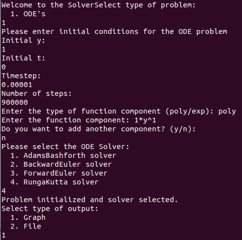
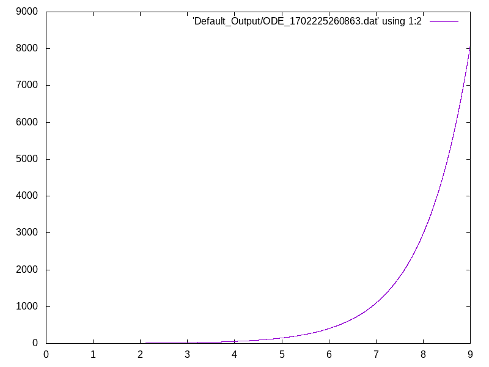
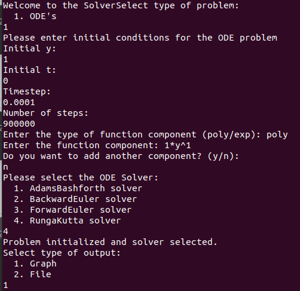
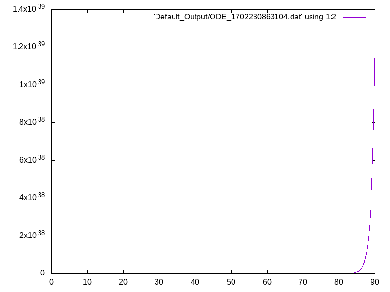

# Ordinary Differential Equations - PCSC
Welcome to our ODE Solver, a comprehensive software developed as a part of the Programming Concepts in Scientific Computing course, December 2023. This program is specifically designed to address the complexities and challenges in solving Ordinary Differential Equations (ODEs). Our main goal is to provide an efficient, user-friendly, and adaptable platform for students, educators, and researchers engaged in the field of scientific computing.

The project has been designed with modularity and flexibility in mind, allowing interested users to easily extend it to a wide range of problems beyond the scope of traditional ODEs. Our design philosophy emphasizes reusability and scalability, ensuring that the program remains a valuable tool for a broad spectrum of computational challenges in scientific computing.

Authors: Oriol Pascual Anglès & Matthias Forestier

## How to compile
### Prerequisities
`sudo apt install cmake`

`sudo apt install doxygen` (only for documentation)

*Other dependent packages such as Boost and GTest are download and use on the fly without the need for installation. However, this means Internet connection is necessary when compiling the project.*

### Compilation and execution
```bash
mkdir build && cd build
cmake ..
make
```

### Documentation
``` bash
firefox docs/html/index.html
```

## Usage and program execution
Execute the program with the following command:
```
./PSCS-ODE
```
1. The program will ask which type of problem we want to solve. For now, only Ordinary Differential Equations problems are supported, therefore introduce

2. The initial conditions and configurations are asked for the problem such as initial y, initial t, timestep and number of steps.

3. Introduce desired function as a linear combination of function components, polynomial(3*y^2) or exponential(2^y). Include signs for '+' and '-' operations.

4. Select solver between the available ODE Solvers. 

5. Select output type. For now, graph and data file are supported.

6. Output will be found inside the "Default_Output" folder.


### Comments on usage
Be careful on the initial conditions and configurations you set for your problem. Depending on the equation the returned function might not exist for y = 0 or it might go to inifinity at some t.

For meaningful results, take into account this.

### Example for y = y'
Solution is y=e^y
#### With meaningful timestep and number of steps
<p align=center>


</p>

#### With not ideal input
Reducing timestep can result in loss of interpretability of the function. The opposite might be true for other functions. It is important to think about the possible outcome function if we care about graph readability.

<p align=center>


</p>

## List of features
### Function and FunctionComponent
Currently, we support functions composed of linear combinations of scalars, polynomial terms and exponentials.

- Scalar: Select poly as input. Enter just a number. Ex: 4.7.
- Polynomial: Select poly as input. Enter a polynomial term including the scalar and exponent even if they are 1. Ex: 3*y^1.
- Exp: Select exp as input. Enter the exponential base. Ex: 2. 

For instance, function input would be:

Supported: (3) (+3*y^2) (-2.5^y)

Unsupported: (3*y^4) (+2^y) ( * 2 *y^4). Reason: multiplication of function components.

Unsupported: (cos(y)). Reason: component not yet supported.


*() are used to indicate different function components* 

### Solvers
Currently, we support discrete solvers using different methods: 
- Adams Bashforth 
- Backward Euler 
- Forward Euler
- Runge Kutta.

## Testing
All non-abstract classes have been tested using the Googletest suite, implementing valid and invalid input scenarios for the different methods. Furthermore, the files have been structured for it to be easy to add additional tests if that was necessary. 

Tests are compiled and execution using a different procedure not to intervene with the main project's compilation. For simplification purposes we have come up with an script that compiles and executes all tests.

```
cd tests
sh testEverything.sh
```

You should see the results of the tests in the command output.

## TODOs and future work
- Personalized output folder
- Further expand the type of function components supported
- Support for functions also dependent on t. Such as y = y' + t
- Support File Input for cleaner input
- Nsteps-Timestep assessment to avoid uncomprehensible plots